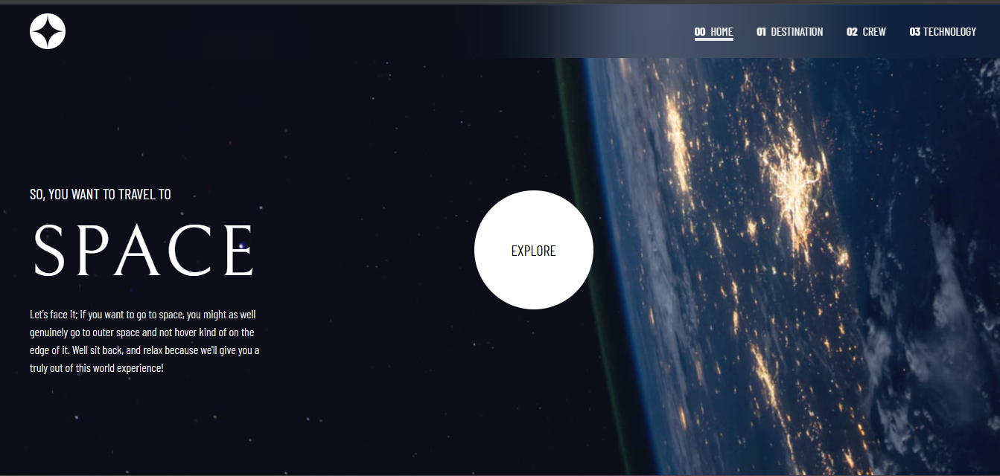
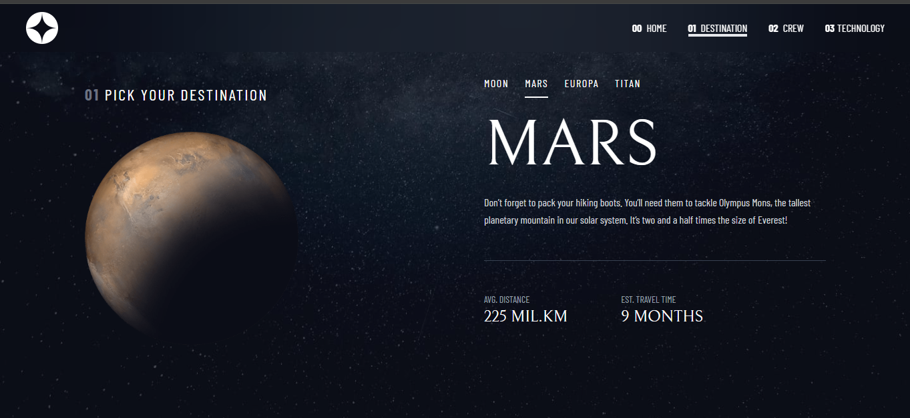

# Frontend Mentor - Space tourism website solution

This is a solution to the [Space tourism website challenge on Frontend Mentor](https://www.frontendmentor.io/challenges/space-tourism-multipage-website-gRWj1URZ3). Frontend Mentor challenges help you improve your coding skills by building realistic projects.

## Table of contents

- [Overview](#overview)
  - [The challenge](#the-challenge)
  - [Screenshot](#screenshot)
  - [Links](#links)
- [My process](#my-process)

  - [Built with](#built-with)
  - [What I learned](#what-i-learned)

- [Author](#author)

## Overview

### The challenge

Users shoyld be able to:

- View the optimal layout for each of the website's pages depending on their device's screen size
- See hover states for all interactive elements on the page
- View each page and be able to toggle between the tabs to see new information

### Screenshot

#### Desktop

####

### Links

- Solution URL: [Add solution URL here](https://your-solution-url.com)
- Live Site URL: [Add live site URL here](https://your-live-site-url.com)

## My process

- Started by setting up the project with **React + TypeScript + TailwindCSS**.
- Implemented routing for different sections (Home, Destination, Crew, Technology) using **React Router**.
- Broke down the Figma design into reusable components.
- Focused on **mobile-first design**, then adjusted layouts with Tailwind’s responsive utilities for tablet and desktop.
- Added state management with `useState` to handle tab switching, navigation dots, and dynamic content.
- Carefully applied **conditional rendering** and responsive background images for each screen size.

### Built with

- Semantic HTML5 markup
- CSS custom properties
- Tailwind Css
- Flexbox
- CSS Grid
- Mobile-first workflow
- [React](https://reactjs.org/) - JS library
- TypeScript

### What I learned

- How to manage **responsive layouts** with Tailwind’s breakpoints and utility classes.
- The difference between `leading` and `tracking` in typography and how they affect readability.
- Handling **image variations** (landscape vs portrait) based on screen sizes.
- How to use `NavLink` with React Router for **active states** in navigation.
- A better understanding of React component structure, props, and conditional class names.
- How to work with **Figma-to-code translation**, balancing design accuracy with clean implementation.  
  **Note: Delete this note and the content within this section and replace with your own learnings.**

## Author

- Chioma Fortune Ineh
